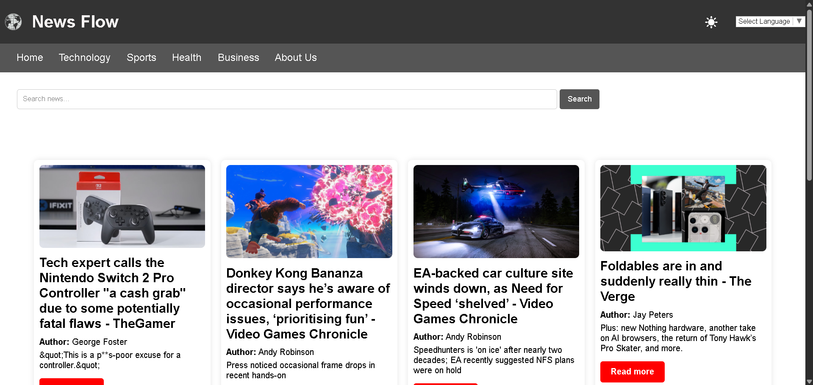
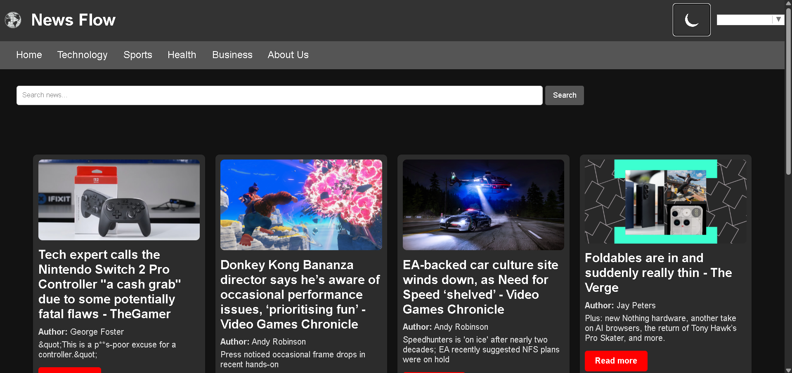
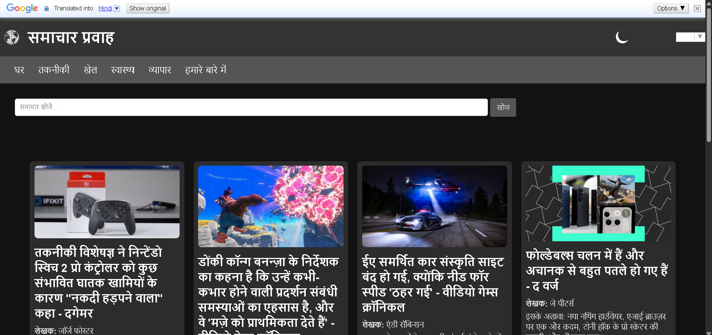

# 📰 NewsFlow - Real-Time News Aggregator 🌍

**NewsFlow** is a responsive, full-stack web application that aggregates real-time global news using the [NewsAPI](https://newsapi.org). Built with Flask and JavaScript, it offers users a sleek and interactive dashboard to explore headlines by category, perform live searches, submit feedback, and switch between multiple languages and themes — all in one place.

---

## 🚀 Features

- 🔍 **Live Search** with debounce functionality
- 📚 **Category-based Filtering** (Technology, Business, Health, Sports, etc.)
- 🧾 **Pagination** – Displays 12 articles per page with clean formatting
- 🌗 **Dark/Light Mode Toggle** via JavaScript & localStorage
- 🌍 **Multilingual Support**
  - Google Translate for 100+ languages
  - Manual local translation (English, Hindi, Bengali)
- 💬 **Feedback Form** – Sends user feedback and stores it in `feedback.json`
- 📱 **Mobile-Responsive Design** with animations and transitions
- 📷 **Only Valid Articles Displayed** – Filters out missing images/authors
- 🎨 **Clean UI/UX** – Includes hover effects, loading animation, and structured layout

---

## 🛠️ Tech Stack

| Layer         | Tools Used                             |
|---------------|----------------------------------------|
| **Frontend**  | HTML, CSS, JavaScript                  |
| **Backend**   | Flask (Python)                         |
| **API**       | NewsAPI                                |
| **Templating**| Jinja2                                 |
| **Storage**   | JSON (for feedback)                    |
| **Translation** | Google Translate + Custom JS Engine  |

---

## 📁 Project Structure

```plaintext
NewsFlow/
├── app.py                  # Main Flask backend app
├── feedback.json           # Stores submitted feedback
├── .env.example    
├── static/                 # Frontend assets (JS, CSS, Images)
│   ├── script.js
│   ├── about.js
│   ├── styles.css
│   ├── aboutstyle.css
│   └── logo.png
├── templates/              # Jinja2 templates
│   ├── main.html
│   └── about.html
├── .gitignore              # Files/folders excluded from Git
└── README.md               # This file
````

---

## 🧠 About the Project

This project demonstrates a practical full-stack application integrating API consumption, dynamic DOM rendering, feedback management, and responsive design. It emphasizes **real-world utility, accessibility, and interactivity** — making it suitable for both desktop and mobile users.

NewsFlow was built as part of an internship project and is architected with **modularity and scalability** in mind, making it ready for production deployment or further extension.

---

## 🖼️ Screenshots

> Replace placeholder image paths with actual images in your repo if needed.

### 🌐 Main Home Page (Light Mode)



---

### 🌗 Dark Mode Enabled



---

### 🌍 Translated to Hindi (Automatic Google API Based Translation)



---

## ⚙️ Setup Instructions

1. **Clone the repository**

```bash
git clone https://github.com/udaykumar0515/RealTime-News-Aggregator
cd RealTime-News-Aggregator
```

2. **Install required packages**

```bash
pip install flask requests
```

**With this (for `.env` method):**
```markdown
3. **Configure API Key using `.env`**

- Get your NewsAPI key from: [https://newsapi.org](https://newsapi.org)
- Create a `.env` file in the root directory of the project:
  
  ```env
  NEWS_API_KEY=your_actual_api_key_here


4. **Run the Flask server**

```bash
python app.py
```

5. **Open in browser**

```
http://127.0.0.1:5000/
```

---
---

## Team Members

This project was developed as part of a team collaboration.

- **Udaykumar**  
  🔗 [GitHub](https://github.com/udaykumar0515)  
  📧 udaykumarhaibathi@gmail.com

- **Pranay**  
  🔗 [GitHub](https://github.com/username1)  
  📧 email@example.com

- **Hasini**  
  🔗 [GitHub](https://github.com/username2)  
  📧 email@example.com

---

## Author

**Haibathi Uday Kumar**  
📧 [udaykumarhaibathi@gmail.com](mailto:udaykumarhaibathi@gmail.com)  
🔗 [LinkedIn](https://linkedin.com/in/uday-kumar-haibathi-311b66322)  
💻 [GitHub](https://github.com/udaykumar0515)

---

## Feedback

Users can submit feedback via the in-app form.
For technical queries or feature suggestions, feel free to open an issue or contact me directly via email.

```
